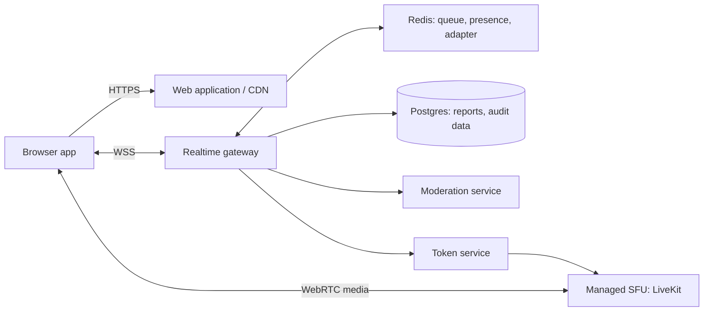

# Production architecture

## What is built first

The local application delivers anonymous text matching, one active peer connection per visitor, message relay, disconnect recovery, and a visible report/leave path. It is deliberately split into a browser app and a realtime service. That separation is the key decision: long-lived WebSocket connections and random matching do not belong in a request/response web deployment.

## Responsibilities

| Component | Owns | Must not own |
| --- | --- | --- |
| Web app | session UI, local identity, accessibility, socket reconnection | matching truth or moderation decisions |
| Realtime gateway | queue state, pair lifecycle, message ordering per pair, abuse limits | persistent report/audit records |
| Redis | distributed wait queues, short-lived room/presence state, Socket.IO adapter | durable user/report data |
| Postgres | reports, blocks, consent records, aggregated safety events | active queues or sockets |
| Moderation worker | text classification, escalation, account/device actions | synchronous message delivery |
| Voice token service + SFU | short-lived room tokens and encrypted WebRTC media forwarding | random match selection |

## Text-match lifecycle

1. The browser generates a random local visitor ID and opens a secure WebSocket.
2. `joinQueue` is validated and added atomically to the relevant language/interest queue. Two people with interests only match when at least one normalized interest overlaps; people who leave interests empty use the classic open random queue.
3. The gateway removes two compatible visitors in one transaction/script and creates a `matchId`.
4. Both clients receive `matched`; all messages are scoped to that match and a monotonic message sequence.
5. `leave`, `next`, disconnect, or a safety action closes the match. The remaining peer gets `peerLeft` and may requeue.
6. Reports write immediately to Postgres and enqueue an asynchronous moderation job. Blocks are checked before matching.

## Scaling text correctly

The included `MemoryMatchmaker` makes the app runnable on one local process only. Replace it with a Redis implementation before deploying horizontally:

- Use Redis lists or sorted sets keyed by normalized preferences (for example `queue:en:world`).
- Use a Lua script / Redis function to pop compatible pairs atomically.
- Use the Socket.IO Redis adapter so a pair may be connected to different gateway pods.
- Keep match records with short TTLs in Redis. Never use a load balancer's sticky sessions as the source of truth.
- Enforce message size, per-socket rate limits, connection limits, and bounded queues at the gateway.

## Voice, after text is stable

Voice uses the *same match lifecycle*, but not the text socket for audio. When both matched users opt in:

1. The gateway verifies the active `matchId`, age/consent policy, blocks, and abuse state.
2. It creates a one-time voice invitation; each user explicitly accepts.
3. A token service issues a short-lived, room-scoped LiveKit (or Daily/Agora) token for `voice-{matchId}`.
4. Browsers publish microphone tracks directly to the SFU using WebRTC. The UI renders each participant's audio level from that participant's track, so each mic icon reacts independently.
5. Leaving a match revokes the token/session and deletes the room after a short TTL. Do not send microphone audio through Socket.IO or route WebRTC peer-to-peer for this product.

An SFU is preferable to browser-to-browser voice because it handles NAT traversal, reconnects, quality adaptation, observability, and later group/safety needs. Use TURN credentials supplied by the provider or your own coturn fleet. HTTPS is mandatory for microphone permission.

## Production checklist

- Put the web client behind a CDN; run the gateway on long-lived containers (ECS/Kubernetes/Fly/Render), not serverless request functions.
- Terminate TLS, enforce a strict origin allow-list, CSP, HSTS, and secure cookies/tokens.
- Add CAPTCHA / device reputation before queue entry, IP and account rate limits, and a circuit breaker for flood traffic.
- Make report, block, next, and emergency help obvious. Store minimal data, publish retention periods, and get legal/privacy review before launch.
- Add OpenTelemetry traces keyed by an opaque match ID, metrics for queue time/match success/abuse, structured logs with content redaction, and alerting.
- Load-test queue scripts and WebSocket disconnect storms. Run end-to-end tests across two gateway instances before release.
- For voice, show clear mic state, require per-call consent, use short-lived room tokens, and never record by default.
